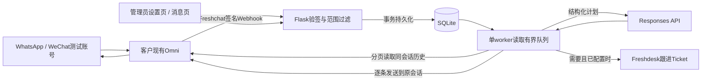

# 技术栈、代码结构与接口

日期：2026-09-22。这里解释当前源码，不是未来架构设计。依赖实际版本以 [requirements.txt](../requirements.txt) 为准。

## 技术栈

| 层 | 选择 | 原因 / 约束 |
| --- | --- | --- |
| 后端 | Python 3.11+、Flask 3.1.3 | 同进程API、静态页面、Webhook和后台任务；本地验证Python 3.14.3 |
| HTTP服务 | Waitress 3.0.2 | `run.py` 单进程8请求线程，不使用开发重载器 |
| 存储 | Python标准库sqlite3、SQLite WAL | 无额外服务，RLock与事务保护写入；实际SQLite版本随Python运行环境 |
| 加密与签名 | cryptography 48.0.1 | Fernet配置/内容加密、RSA-SHA256验签；Werkzeug提供密码哈希 |
| 前端 | 原生HTML、CSS、JavaScript | 单页壳，设置/消息两个路由；同源fetch、3秒轮询，无npm运行依赖 |
| 供应商请求 | 标准库http.client、ssl、socket | 公网DNS检查、固定验证IP连接、TLS主机校验、超时及响应大小限制 |
| 模型 | OpenAI Responses HTTP API | 自带历史上下文、严格JSON Schema、store=false；支持管理员配置兼容地址 |
| 单测 | unittest、unittest.mock、临时SQLite | 不读取真实业务配置，阻止意外供应商网络 |
| UI验证 | 环境已有agent-browser / Chrome | 独立合成测试实例，无需项目自动安装浏览器；证据见验收报告 |

无Redis、Kafka、向量库、ORM、独立LLM网关或通用插件系统。`run.py` 的 `fcntl` 锁要求Unix类环境，Windows用WSL。

## 代码导航

| 路径 | 职责 |
| --- | --- |
| [run.py](../run.py) | 读取启动参数、数据库进程锁、Waitress入口 |
| [scripts/init_local.py](../scripts/init_local.py) | 仅生成本机启动.env、随机主密钥及初始管理员密码 |
| [lsp/app.py](../lsp/app.py) | Flask路由、登录/CSRF/Origin、文件访问、Webhook原始body验签入口 |
| [lsp/settings.py](../lsp/settings.py) | DEFAULTS/BOUNDS、字段验证、密钥掩码、配置版本、能力门槛 |
| [lsp/store.py](../lsp/store.py) | SQLite表结构、事务嵌套复用、加解密、审计写入 |
| [lsp/security.py](../lsp/security.py) | URL/ID校验、公网DNS与TLS连接、固定错误、签名与文件校验 |
| [lsp/providers.py](../lsp/providers.py) | Freshchat历史/发送/上传、Freshdesk请求、Responses上下文/schema/输出解析 |
| [lsp/service.py](../lsp/service.py) | 入站/测试码/历史/AI/人工/素材/工单/任务/恢复/清理的业务流程 |
| [templates/index.html](../templates/index.html) | 页面壳与对话框挂载点 |
| [static/app.js](../static/app.js) | 登录、设置、测试账号开关、消息/任务、素材、工单、能力矩阵 |
| [static/app.css](../static/app.css)、[favicon.svg](../static/favicon.svg) | 样式、响应式和图标 |
| [tests/test_demo.py](../tests/test_demo.py) | 核心自动化测试及回归 |
| [tests/browser_app.py](../tests/browser_app.py) | 历史/媒体/工单的本地合成UI实例 |
| [tests/pairing_browser_app.py](../tests/pairing_browser_app.py) | 双渠道测试码/真实本地验签/人工切换的合成UI实例 |

文档只解释代码，不复制整份源码；点击上表即可阅读实现。

## 数据流

Webhook验签和事务完成后返回，不等待模型或平台外发。范围外事件不进入消息、会话、历史同步或AI任务表；短时监听期间只缓存脱敏候选元数据，点选后才建立会话并同步历史。签名失败/解析失败/持久化失败不返回伪成功。

快速绑定沿用原始事件的客户ID/会话ID/来源，白名单保存实际客户ID，额外核对来源配对。配置版本改变会取消旧任务并重新检查已绑定账号。首次绑定使普通试运行可在尚未完成手动文本验收时启用，但能力矩阵保留未验证事实。

## SQLite 与身份隔离

| 表 | 保存内容 / 约束 |
| --- | --- |
| `meta` | 加密设置、版本、自动启用边界、管理员哈希、加密测试码与绑定状态 |
| `sessions` | 管理会话ID、CSRF、有效期；Cookie为HttpOnly/SameSite，公网启用Secure |
| `conversations` | 当前租户指纹、真实会话/用户/来源、渠道、模式、同步游标；唯一tenant+platform_id |
| `messages` | 平台消息ID、角色/时间/私有标记、加密parts；唯一tenant+conversation+platform_id |
| `events` | 事件去重、载荷版本、重试次数；唯一tenant+conversation+message+action |
| `assets` | 逻辑ID、版本、文件路径/MIME/大小、渠道、启用状态、加密平台引用 |
| `jobs` | 类型、状态、配置版本、触发ID、batch/seq、尝试/时间、加密计划与结果；唯一batch+seq |
| `tickets` | 本地会话与事项到真实工单映射；唯一tenant+conversation+matter |
| `checks` | 版本与渠道维度能力状态、测试对象、加密证据和时间 |
| `logs` | 精简运行事件，不保存完整供应商响应/凭证 |
| `usage` | AI请求ID、预算预占、实际tokens及耗时 |

tenant指纹由平台地址和Token计算；轮换平台凭证也要求重新导入和验证。不是完整多租户SaaS。加密保护选定字段，ID索引元数据和磁盘媒体不是整库加密；部署另行保护磁盘与备份。不同渠道的用户ID不自动合并，即使同人拥有两个账号。

历史初始化遍历到空页，重复页视为错误；增量游标来自最后成功API同步，不从最新Webhook消息推断。模型上下文另做保守预算截断，内部备注不进入模型。

## 任务处理与外发边界

任务类型为 `sync`、`activate_test`、`generate`、`send`、`ticket`。worker全局顺序执行；两渠道可同时处于AI模式，但模型请求不是并行执行。慢调用会使其他任务等待。

- 普通处理：queued → generating → completed/failed；发送为pending → sending → accepted/failed/unknown。
- 人工/配置/客户追加取消旧任务；同计划后续条目在前项失败时paused。
- 自动发送前复核配置版本、测试身份、来源、模式及触发消息边界；不能撤回已进入供应商请求的在途发送。
- 重启时sending改unknown；generating恢复queued。activate_test重新核实当前授权，已完成激活不重复生成问候。
- 仅安全429等情况退避重试；结果不明绝不自动重发。人工重试需要明确重复风险及核实依据。
- accepted仅说明平台API给出消息ID。当前没有渠道专有机器回执接入；人工确认保留accepted并另外保存证据。

## 后端接口

除Webhook、调度和限用途签名媒体地址外，`/api/`业务接口要求管理员会话；写请求须带 `X-CSRF-Token` 并满足Origin检查。不存在面向第三方的通用管理员Bearer Token。以下 `{id}` 是Demo本地整数会话ID，平台ID在请求体或响应字段中明确给出。

| 方法与路径 | 请求 / 用途 |
| --- | --- |
| `GET /api/auth` | 查询登录、取得登录或当前会话CSRF；不得公开响应 |
| `POST /api/login`、`POST /api/logout` | password登录/退出，登录也需nonce cookie与CSRF |
| `GET/PUT /api/settings` | 脱敏读取、部分更新业务设置；见完整参数表 |
| `GET /api/agents` | 当前租户可用坐席列表 |
| `GET /api/status` | 路线/自动开关/本地任务统计，tenant_verified始终如实显示 |
| `POST /api/checks` | kind=openai/platform_read/send/verify_outbound/record；发送必须明确确认；通过不能伪造 |
| `GET /api/capabilities`、`GET /api/events` | 矩阵与当前版本检查、最近50个已接纳事件 |
| `GET /api/test-discovery` | 当前监听窗口、脱敏候选、绑定列表和独立开关状态；仅限登录管理员 |
| `POST /api/test-discovery/bind-next` | `{"channel":"WhatsApp"}`；开启5分钟短时监听，不自动回复 |
| `POST /api/test-discovery/select` | `{"conversation_id":"<PLATFORM_CONVERSATION_ID>"}`；点选候选后读取历史并加入白名单 |
| `POST /api/test-discovery` | 兼容旧测试码流程；`{"channel":"WhatsApp","confirm_auto_reply":true}` |
| `PUT /api/test-discovery/mode` | `{"channel":"WeChat","enabled":false}`，该渠道账号人工接管；true明确恢复 |
| `DELETE /api/test-discovery` | 空JSON对象，结束全部测试；不是删除平台会话 |
| `POST /api/conversations/import` | conversation_id或user_id；手动读取真实会话，保留旧导入方式 |
| `GET /api/conversations` | 本地导入/事件产生的列表，q/channel筛选，无虚构全租户枚举接口 |
| `POST /api/conversations/{id}/test-access` | 旧手动授权channel、scope；scope=customer会替换整个范围，不能用来追加双渠道测试 |
| `GET /api/conversations/{id}/messages` | before偏移、limit最多100；返回时间范围、同步状态、任务/工单/日志 |
| `POST /api/conversations/{id}/sync` | 排队全量补齐可访问历史 |
| `POST /api/conversations/{id}/messages` | messages数组及confirm_send=true；文本/素材版本计划，返回独立任务ID |
| `PUT /api/conversations/{id}/mode` | mode=manual/auto/off；自动模式仍检查当前授权 |
| `POST /api/conversations/{id}/ai-preview` | 排队真实生成，保存计划但不发送 |
| `POST /api/conversations/{id}/ticket` | reason及new_matter；创建或复用事项工单任务 |
| `GET /api/jobs/{job_id}` | 当前租户脱敏任务状态、计划、错误和结果 |
| `POST /api/jobs/{job_id}/resolve` | action=cancel/retry/link_existing，要求核实证据；retry需ack_duplicate_risk |
| `GET/POST /api/assets` | 素材列表、新版本；本地multipart file+metadata，或JSON审核url |
| `PATCH /api/assets/{asset_id}` | 更新名称/用途/标签/渠道/启用，不替换队列绑定的文件版本 |
| `POST /api/assets/{asset_id}/upload` | 真实平台图片/文件上传，视频准备签名引用 |
| `GET /api/assets/{asset_id}/content` | 登录管理员预览/下载 |
| `GET /api/conversations/{id}/media/{message_id}/{part}` | 管理员授权媒体代理，检查来源主机、MIME和大小 |
| `GET /media/{token}` | 供平台抓取的24小时签名素材地址，限定租户/版本/用途 |
| `POST /api/webhooks/freshchat` | 独立RSA签名，正常message_create载荷；不使用管理员登录 |
| `POST /api/internal/jobs/drain` | 独立Scheduler Token、固定tasks、有界limit及显式执行；见调度文档 |

错误响应采用 `{error, message}`，不返回供应商完整异常。400为输入错误，401/403为认证/权限，409为模式/状态冲突，502/503等表示上游或配置/服务失败；每项具体语义以响应及调度文档为准。

## 外部API与代码边界

Freshchat：`GET /v2/agents`、`GET /v2/conversations/{platform_id}`、`GET .../messages`、`GET /v2/users/{user_id}/conversations`、`POST .../messages`、`POST /v2/images/upload`、`POST /v2/files/upload`。消息外层normal/agent/真实actor_id，多条独立回复逐条POST。无自造 `/videos/upload`。

Freshdesk：Basic `<API_KEY>:X`，跟进建单 `POST /api/v2/tickets`，读真实Ticket用于核实关联；不包含新版Omni公开会话回复适配。OpenAI：配置地址的Responses端点、Bearer、可选Project/Organization Header、严格schema及store=false。

具体契约、官方依据与未实测点见 [API依据](api-evidence.md)。这些路径在代码中存在不等于实际租户或连接器已支持。
